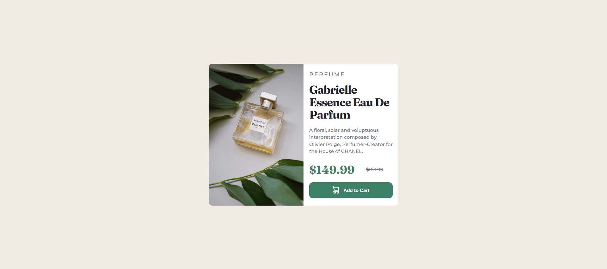

# Frontend Mentor - Product preview card component solution

## Table of contents

- [Overview](#overview)
  - [The challenge](#the-challenge)
  - [Screenshot](#screenshot)
  - [Links](#links)
- [My process](#my-process)
  - [Built with](#built-with)
  - [What I learned](#what-i-learned)
- [Author](#author)

## Overview

### The challenge

Users should be able to:

- View the optimal layout depending on their device's screen size
- See hover and focus states for interactive elements

### Screenshot

### Links

- Solution URL: [Github Repo](https://github.com/devendra-alt/preview-card-component-solution)
- Live Site URL: [product-preview-card-com](https://product-preview-card-com-fd232.web.app/)

## My process

### Built with

- Semantic HTML5 markup
- CSS custom properties
- Flexbox
- CSS Grid

### What I learned

i have learned so much about website developement in this challenge as responsive design, accesability, media query, layouts etc.

## Author

- Website - [devendra-alt](https://devendra-alt.github.io/)
- Frontend Mentor - [@devendra-alt](https://www.frontendmentor.io/profile/devendra-alt)
